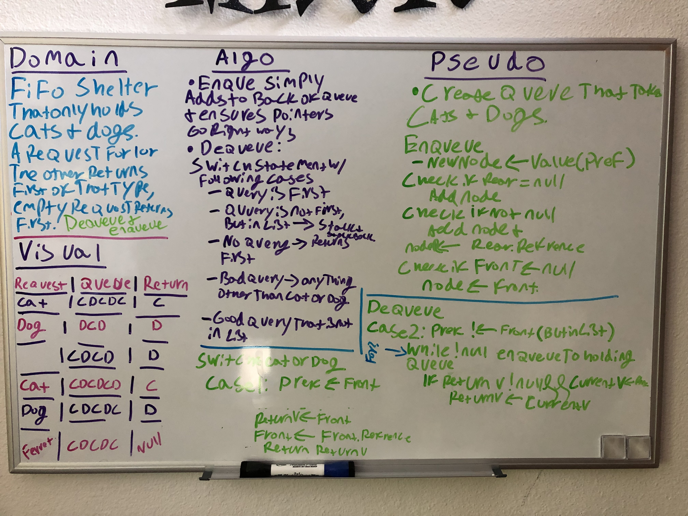
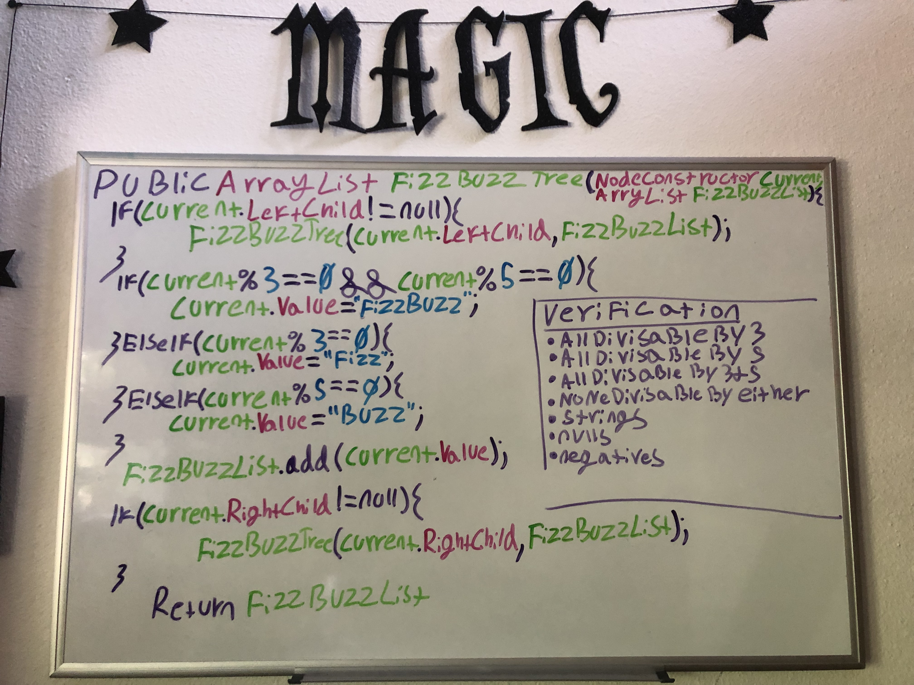
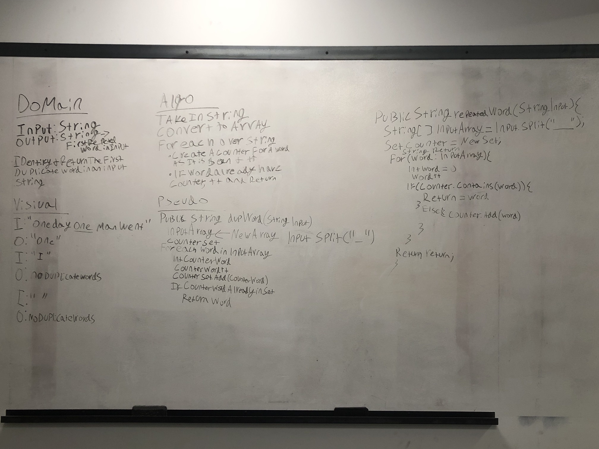
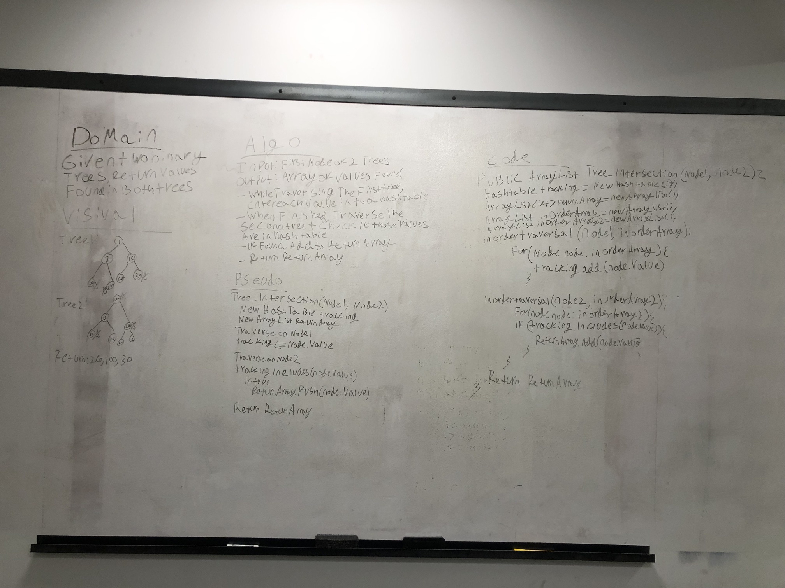
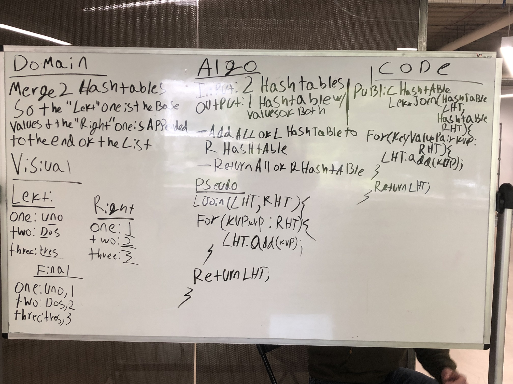

# Data Structures and Algorithms, the Java Version 

1. [ArrayShift](./src/main/java/ArrayShift.java)
    
2. [Binary Search](./src/main/java/BinarySearch.java)
        
3. [Linked List](./src/main/java/linkedlist/LinkedList.java)
    
    - [Merge Linked Lists](./src/main/java/linkedlist/MergeList.java)
        
        This is the whiteboard the final version of my merge lists method is based off of.
        
        This is an earlier version of the whiteboard, created with Dana Voros, which does not meet the On space requirement
        of the challenge. Ultimately this was refactored via a second whiteboard and some adjustments while coding it out.  
4.  [PseudoQueue](./src/main/java/stacksandqueues/PseudoQueue.java)
        
        
5.  [FIFO Animals](./src/main/java/stacksandqueues/fifoanimalshelter) 
        
        
        
6.  [Multi Bracket Validation](./src/main/java/MultiBracketValidation.java)
        Given a string of brackets, this method will return a boolean - true if they are "balanced", false if they are not. 
        
        
        
        
     ### Approach and Efficiency  
     I choose to use a switch statement with a while loop, as it was the first solution I could produce functional code 
     for. Upon further reflection, I would alter this if I were to tackle this challenge again.  Given the while loop and
     the for each, this will be On2 in every scenario, except for an early failure off of a negative. I am also creating 
     an additional array, so that will be On for space. 
     
7. [kth From the End Search](https://github.com/MerrybyPractice/java_data_structures_and_algo/pull/8)
    
    
8. [FizzBuzz Tree]()
    
    
  Replicate the classic FizzBuzz challenge on a binary tree. 
   
   ## Challenge
   The challenge here was to iterate over a binary tree and replace every value that was divisible by 3 with Fizz, every 
   value that was divisable by 5 with Buzz, and every value that was divisible by both with FizzBuzz.  
   
   ## Approach & Efficiency
   I opted to use recursive iteration and if statements to accomplish this. I choose to use an in order traversal as I 
   felt it would produce an Array List with the best representation of the tree. As I am creating a new collection, space
   will be 0(n) and time should just be 0(1).

9. [Breadth First Traversal](./src/main/java/tree/BreadthFirst.java) 
    
    
  Create a breadth first traversal that extends my BinaryTree class can be utilized with my other tree classes. 
  
  ## Challenge
  In this challenge, I was asked to write a breadth first traversal to compliment my existing suite of tree traversals.
  This traversal was required to take in an access point to a tree, and print the node values it came across.  
  
  ## Approach & Efficiency  
  Initially I wanted to find a recursive way to accomplish this, and while I am sure there is a variation on the classic depth 
  traversals that will accomplish that I ended up settling for a while loop. In my initial whiteboard I did not include 
  a returned collection, but implemented an array list in my final code so that the whole thing was far more testable. As 
  this approach uses a queue to track the node values and an array list to return them, its space will be O(n1), while it 
  should only be O(n) for time due to the while loop.   

10. [Maximum Value of a Tree](./src/main/java/tree/findMaximumValue.java)
    
    
    
    ## Challenge 
        Write a method that will sum the maximum value of the nodes in a tree. 

    ## Approach and Efficiency 
    I based this method closely on the FizzBuzz and Breadth First trees, employing a while loop to do the traversal and a
    queue to do the traversal. It should have O(n) space and time efficiency.  
    
11. [HashTable](./src/main/java/hash/Hashtable.java)
    ## Challenge 
       Write a class that will create and manage a hash table. For further information, see the hashtable readme [here](./src/main/java/hash/README.md). 

12. [RepeatedWord](./src/main/java/hash/RepeatedWord.java)
    
    
    ## Challenge 
    Write a method that will identify and return the first duplicate word in a string. 
    
    ## Approach and Efficiency
    
    Using a hash set and a for each, this approach should be O(N) for time and space.

13.[TreeIntersection](./src/main/java/hash/TreeIntersection.java)
    
    
   ## Challenge 
   Write a method that will identify and return a collection of matching values between binary trees. 
   
   ## Approach and Efficiency 
   I opted to use a hash table for optimal look up time, but needed to implement three different array lists which destroys  
   my big O space. 
       
14.[LeftJoin]()
    
    
   ## Challenge 
   Write a method that will merge and return two hash tables. 
   
   ## Approach and Efficiency
   My proposed approach makes use of the way my hashtable inherently handles collisions. Due to the for each loop, it will 
   have a O(n) time, although it does not make any additional collections so I believe has O(1) space. 

15.[Graph](./src/main/java/graph/graph.java)
    
   ## Challenge 
   Write a Graph with methods for: 
   
   - graph.addNode(String value)
        Takes a value and creates a linked list in the Array List with that as the head. 
   - graph.addEdge(int weight, int index1, int index2)
        Adds an edge between two indexes with the given weight. This edge is directional from index1 to index2. 
   - graph.getNodes()
        Prints out all nodes currently in the graph. 
   - graph.getNeighbors()
        Prints out all the neighbors of a given node and their edge weights. The first value in this list will be the given node. 
   - graph.getSize()
        Returns an integer of the size of the graph.
        
   ## Approach and Efficiency
   
   The graph is represented by an adjacency list. This list is simply an array list of linked lists - allowing for flexibility in both the number of nodes 
   and in the number of edges added to and from each node.     
   

Lecture Series 

A series of lecture notes on important algorithms and their accompanying implementations. These are all designed for an 
intermediate student who is primarily familiar with JavaScript. 

Lecture 1: [Insertion Sort](./src/main/java/insertionsort/insertionSortLecture.md) 
           [Implementation](./src/main/java/insertionsort/InsertionSort.java) 
   
Lecture 2: [Merge Sort](./src/main/java/mergesort/lecture.md)
           [Implementation](./src/main/java/mergesort/MergeSort.java) 
           
Lecture 3: [Quick Sort]()
           [Implementation]() 